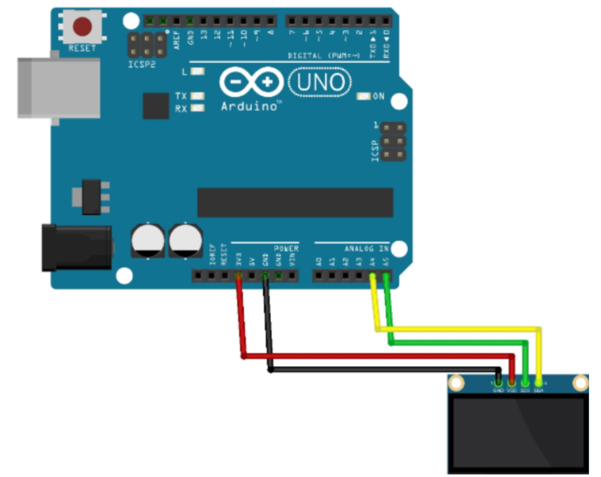
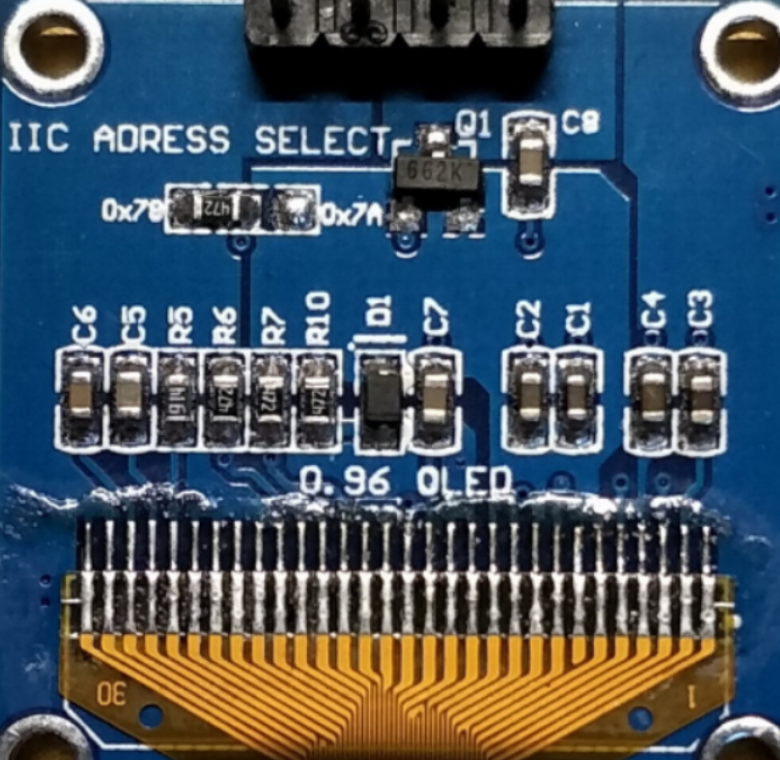

# SSD1306驱动

0.96寸 OLED-128X64 SSD1306屏幕采用IIC与Arduino进行通信，通过对Arduino进行编程，可以让OLED屏幕显示你想要的内容，下面将讲解SSD1306的基本使用。


> 注意：SSD1306分为SPI通讯版本和IIC通讯版本，这里使用的是IIC通信版本，只需要4根引脚就可以进行驱动


## 引脚分布

OLED 显示屏有四个引脚，分别是：

- SDA(数据线)
-  SCK(时钟线) 
- VDD(3.3V)
-  GND


## 连接方式




> 在UNO开发板上I2C接口，SDA对应D4，SCK对应D5
> 在MEGA2560开发板上I2C接口,SDA对应D20, SCL对应D21


## 通信地址



<center>背面图</center>

模块背面的IIC ADRESSSELECT表示该模块在IIC通信作为从机时的地址，当中间的脚用电阻和左边接起来时，地址为0x78，当和右边接起来时，地址为0x7A。


这款屏幕尺寸约为0.96英寸，由SSD1306驱动，驱动接口I2C，I2C地址(0x3c 默认/0x3d)。
不同型号有不同的通信地址，可通过程序查询：

```c++
#include <Wire.h>  
   
void setup(){  
  Wire.begin();  
  Serial.begin(9600);  
  Serial.println("\nI2C Scanner");  
}  
void loop(){  
  byte error, address;  
  int nDevices;  
  Serial.println("Scanning...");  
  nDevices = 0;  
  for (address = 1; address < 127; address++ ){  
    // The i2c_scanner uses the return value of  
    // the Write.endTransmisstion to see if  
    // a device did acknowledge to the address.  
    Wire.beginTransmission(address);  
    error = Wire.endTransmission();  
    if (error == 0){  
      Serial.print("I2C device found at address 0x");  
      if (address < 16)  
        Serial.print("0");  
      Serial.print(address, HEX);  
      Serial.println(" !");  
      nDevices++;  
    }else if (error == 4){  
      Serial.print("Unknow error at address 0x");  
      if (address < 16)  
        Serial.print("0");  
      Serial.println(address, HEX);  
    }  
  }  
  if (nDevices == 0)  
    Serial.println("No I2C devices found\n");  
  else  
    Serial.println("done\n");  
  delay(5000); // wait 5 seconds for next scan  
} 


```


## 上手教程

### 第三方库安装

使用ssd1306必须先安装第三方的驱动，事实上，市场上有两种常见的库可以供大家使用，第一种是**Adafruit_GFX+Adafruit_SSD1306**搭配使用，第二种是使用**U8G2**库使用，第一种相较于第二种而言可以消耗较少的动态内存，但是U8G2的通用性更强一些。


在这里我们分别用两种选型来跑一下HelloWorld。


### HelloWorld(Adafruit_GFX+Adafruit_SSD1306)

先让我们打印一下HelloWorld来看看它的代码结构吧，HelloWorld

```c++
#include <Wire.h>

#include <Adafruit_GFX.h>
#include <Adafruit_SSD1306.h>
 
#define OLED_RESET 4
Adafruit_SSD1306 display(OLED_RESET);    // 实例化一个OLED对象
 
#define NUMFLAKES 10
#define XPOS 0
#define YPOS 1
#define DELTAY 2
 
#define LOGO16_GLCD_HEIGHT 16 
#define LOGO16_GLCD_WIDTH  16 
 
#if (SSD1306_LCDHEIGHT != 64)
#error("Height incorrect, please fix Adafruit_SSD1306.h!");
#endif

void setup()        //初始化
{
  Serial.begin(9600);
  delay(500);

  // by default, we'll generate the high voltage from the 3.3v line internally! (neat!)
  display.begin(SSD1306_SWITCHCAPVCC, 0x3C);  // initialize with the I2C addr 0x3C (for the 128x64) ，0x3C为I2C协议通讯地址，需根据实际情况更改
}
void loop()
{
  test_SSD1306();     //调用测试函数
}

void test_SSD1306(void)   //测试函数
{
  display.clearDisplay();   // 清除display中的缓存
  display.setTextSize(1.5); //选择字号
  display.setTextColor(WHITE);  //字体颜色
  display.setCursor(0,0);   //起点坐标
  display.println("Hello World!");
  display.display();  //显示内容
  Serial.println("Hello World");
  delay(2000);

}
```


**例程过程讲解:**

1.初始化display对象

```c++
Adafruit_SSD1306 display(OLED_RESET);    // 实例化一个OLED对象
```

2.IIC地址挂载

```c++
display.begin(SSD1306_SWITCHCAPVCC, 0x3C); 
```

3.显示内容

```c++
display.clearDisplay();   // 清除display中的缓存
display.setTextSize(1); //选择字号
display.setTextColor(WHITE);  //字体颜色
display.setCursor(0,0);   //起点坐标
display.println("Hello World!");
display.display();  //刷新显示的内容
delay(2000);
```


### HelloWolrd(U8G2)

```c++
#include <Arduino.h>
#include <U8g2lib.h>

#ifdef U8X8_HAVE_HW_I2C
#include <Wire.h>
#endif

U8G2_SSD1306_128X64_NONAME_F_HW_I2C u8g2(U8G2_R0,SCL,SDA,U8X8_PIN_NONE);

void setup(void) 
{
  u8g2.begin();
}

void loop(void) 
{
  u8g2.clearBuffer();  //清除缓存         
  u8g2.setFont(u8g2_font_ncenB08_tr); 
  u8g2.drawStr(0,10,"Hello World!");  
  u8g2.drawStr(0,20,"This is bro cainiao!");  
  u8g2.drawStr(0,30,"Welcome to U8G2!");  
  u8g2.sendBuffer();  //显示      
  delay(1000);  
}

```


### draw(Adafruit_GFX+Adafruit_SSD1306)

我们不仅可以在屏幕上打印出字符串，也可以画一些内容出来，如下面代码所示

```c++
/*********************************************************************
This is an example for our Monochrome OLEDs based on SSD1306 drivers

  Pick one up today in the adafruit shop!
  ------> http://www.adafruit.com/category/63_98

This example is for a 128x64 size display using I2C to communicate
3 pins are required to interface (2 I2C and one reset)

Adafruit invests time and resources providing this open source code, 
please support Adafruit and open-source hardware by purchasing 
products from Adafruit!

Written by Limor Fried/Ladyada  for Adafruit Industries.  
BSD license, check license.txt for more information
All text above, and the splash screen must be included in any redistribution
*********************************************************************/

#include <Wire.h>
#include <Adafruit_GFX.h>
#include <Adafruit_SSD1306.h>

#define OLED_RESET 4
Adafruit_SSD1306 display(OLED_RESET);

#define NUMFLAKES 10
#define XPOS 0
#define YPOS 1
#define DELTAY 2


#define LOGO16_GLCD_HEIGHT 16 
#define LOGO16_GLCD_WIDTH  16 
static const unsigned char PROGMEM logo16_glcd_bmp[] =
{ B00000000, B11000000,
  B00000001, B11000000,
  B00000001, B11000000,
  B00000011, B11100000,
  B11110011, B11100000,
  B11111110, B11111000,
  B01111110, B11111111,
  B00110011, B10011111,
  B00011111, B11111100,
  B00001101, B01110000,
  B00011011, B10100000,
  B00111111, B11100000,
  B00111111, B11110000,
  B01111100, B11110000,
  B01110000, B01110000,
  B00000000, B00110000 };

#if (SSD1306_LCDHEIGHT != 64)
#error("Height incorrect, please fix Adafruit_SSD1306.h!");
#endif

void setup()   {                
  Serial.begin(9600);

  // by default, we'll generate the high voltage from the 3.3v line internally! (neat!)
  display.begin(SSD1306_SWITCHCAPVCC, 0x3D);  // initialize with the I2C addr 0x3D (for the 128x64)
  // init done
  
  display.display(); // show splashscreen
  delay(2000);
  display.clearDisplay();   // clears the screen and buffer

  // draw a single pixel
  display.drawPixel(10, 10, WHITE);
  display.display();
  delay(2000);
  display.clearDisplay();

  // draw many lines
  testdrawline();
  display.display();
  delay(2000);
  display.clearDisplay();

  // draw rectangles
  testdrawrect();
  display.display();
  delay(2000);
  display.clearDisplay();

  // draw multiple rectangles
  testfillrect();
  display.display();
  delay(2000);
  display.clearDisplay();

  // draw mulitple circles
  testdrawcircle();
  display.display();
  delay(2000);
  display.clearDisplay();

  // draw a white circle, 10 pixel radius
  display.fillCircle(display.width()/2, display.height()/2, 10, WHITE);
  display.display();
  delay(2000);
  display.clearDisplay();

  testdrawroundrect();
  delay(2000);
  display.clearDisplay();

  testfillroundrect();
  delay(2000);
  display.clearDisplay();

  testdrawtriangle();
  delay(2000);
  display.clearDisplay();
   
  testfilltriangle();
  delay(2000);
  display.clearDisplay();

  // draw the first ~12 characters in the font
  testdrawchar();
  display.display();
  delay(2000);
  display.clearDisplay();

  // draw scrolling text
  testscrolltext();
  delay(2000);
  display.clearDisplay();

  // text display tests
  display.setTextSize(1);
  display.setTextColor(WHITE);
  display.setCursor(0,0);
  display.println("Hello, world!");
  display.setTextColor(BLACK, WHITE); // 'inverted' text
  display.println(3.141592);
  display.setTextSize(2);
  display.setTextColor(WHITE);
  display.print("0x"); display.println(0xDEADBEEF, HEX);
  display.display();
  delay(2000);

  // miniature bitmap display
  display.clearDisplay();
  display.drawBitmap(30, 16,  logo16_glcd_bmp, 16, 16, 1);
  display.display();

  // invert the display
  display.invertDisplay(true);
  delay(1000); 
  display.invertDisplay(false);
  delay(1000); 

  // draw a bitmap icon and 'animate' movement
  testdrawbitmap(logo16_glcd_bmp, LOGO16_GLCD_HEIGHT, LOGO16_GLCD_WIDTH);
}


void loop() {
  
}


void testdrawbitmap(const uint8_t *bitmap, uint8_t w, uint8_t h) {
  uint8_t icons[NUMFLAKES][3];
  srandom(666);     // whatever seed
 
  // initialize
  for (uint8_t f=0; f< NUMFLAKES; f++) {
    icons[f][XPOS] = random() % display.width();
    icons[f][YPOS] = 0;
    icons[f][DELTAY] = random() % 5 + 1;
    
    Serial.print("x: ");
    Serial.print(icons[f][XPOS], DEC);
    Serial.print(" y: ");
    Serial.print(icons[f][YPOS], DEC);
    Serial.print(" dy: ");
    Serial.println(icons[f][DELTAY], DEC);
  }

  while (1) {
    // draw each icon
    for (uint8_t f=0; f< NUMFLAKES; f++) {
      display.drawBitmap(icons[f][XPOS], icons[f][YPOS], logo16_glcd_bmp, w, h, WHITE);
    }
    display.display();
    delay(200);
    
    // then erase it + move it
    for (uint8_t f=0; f< NUMFLAKES; f++) {
      display.drawBitmap(icons[f][XPOS], icons[f][YPOS],  logo16_glcd_bmp, w, h, BLACK);
      // move it
      icons[f][YPOS] += icons[f][DELTAY];
      // if its gone, reinit
      if (icons[f][YPOS] > display.height()) {
	icons[f][XPOS] = random() % display.width();
	icons[f][YPOS] = 0;
	icons[f][DELTAY] = random() % 5 + 1;
      }
    }
   }
}


void testdrawchar(void) {
  display.setTextSize(1);
  display.setTextColor(WHITE);
  display.setCursor(0,0);

  for (uint8_t i=0; i < 168; i++) {
    if (i == '\n') continue;
    display.write(i);
    if ((i > 0) && (i % 21 == 0))
      display.println();
  }    
  display.display();
}

void testdrawcircle(void) {
  for (int16_t i=0; i<display.height(); i+=2) {
    display.drawCircle(display.width()/2, display.height()/2, i, WHITE);
    display.display();
  }
}

void testfillrect(void) {
  uint8_t color = 1;
  for (int16_t i=0; i<display.height()/2; i+=3) {
    // alternate colors
    display.fillRect(i, i, display.width()-i*2, display.height()-i*2, color%2);
    display.display();
    color++;
  }
}

void testdrawtriangle(void) {
  for (int16_t i=0; i<min(display.width(),display.height())/2; i+=5) {
    display.drawTriangle(display.width()/2, display.height()/2-i,
                     display.width()/2-i, display.height()/2+i,
                     display.width()/2+i, display.height()/2+i, WHITE);
    display.display();
  }
}

void testfilltriangle(void) {
  uint8_t color = WHITE;
  for (int16_t i=min(display.width(),display.height())/2; i>0; i-=5) {
    display.fillTriangle(display.width()/2, display.height()/2-i,
                     display.width()/2-i, display.height()/2+i,
                     display.width()/2+i, display.height()/2+i, WHITE);
    if (color == WHITE) color = BLACK;
    else color = WHITE;
    display.display();
  }
}

void testdrawroundrect(void) {
  for (int16_t i=0; i<display.height()/2-2; i+=2) {
    display.drawRoundRect(i, i, display.width()-2*i, display.height()-2*i, display.height()/4, WHITE);
    display.display();
  }
}

void testfillroundrect(void) {
  uint8_t color = WHITE;
  for (int16_t i=0; i<display.height()/2-2; i+=2) {
    display.fillRoundRect(i, i, display.width()-2*i, display.height()-2*i, display.height()/4, color);
    if (color == WHITE) color = BLACK;
    else color = WHITE;
    display.display();
  }
}
   
void testdrawrect(void) {
  for (int16_t i=0; i<display.height()/2; i+=2) {
    display.drawRect(i, i, display.width()-2*i, display.height()-2*i, WHITE);
    display.display();
  }
}

void testdrawline() {  
  for (int16_t i=0; i<display.width(); i+=4) {
    display.drawLine(0, 0, i, display.height()-1, WHITE);
    display.display();
  }
  for (int16_t i=0; i<display.height(); i+=4) {
    display.drawLine(0, 0, display.width()-1, i, WHITE);
    display.display();
  }
  delay(250);
  
  display.clearDisplay();
  for (int16_t i=0; i<display.width(); i+=4) {
    display.drawLine(0, display.height()-1, i, 0, WHITE);
    display.display();
  }
  for (int16_t i=display.height()-1; i>=0; i-=4) {
    display.drawLine(0, display.height()-1, display.width()-1, i, WHITE);
    display.display();
  }
  delay(250);
  
  display.clearDisplay();
  for (int16_t i=display.width()-1; i>=0; i-=4) {
    display.drawLine(display.width()-1, display.height()-1, i, 0, WHITE);
    display.display();
  }
  for (int16_t i=display.height()-1; i>=0; i-=4) {
    display.drawLine(display.width()-1, display.height()-1, 0, i, WHITE);
    display.display();
  }
  delay(250);

  display.clearDisplay();
  for (int16_t i=0; i<display.height(); i+=4) {
    display.drawLine(display.width()-1, 0, 0, i, WHITE);
    display.display();
  }
  for (int16_t i=0; i<display.width(); i+=4) {
    display.drawLine(display.width()-1, 0, i, display.height()-1, WHITE); 
    display.display();
  }
  delay(250);
}

void testscrolltext(void) {
  display.setTextSize(2);
  display.setTextColor(WHITE);
  display.setCursor(10,0);
  display.clearDisplay();
  display.println("scroll");
  display.display();
 
  display.startscrollright(0x00, 0x0F);
  delay(2000);
  display.stopscroll();
  delay(1000);
  display.startscrollleft(0x00, 0x0F);
  delay(2000);
  display.stopscroll();
  delay(1000);    
  display.startscrolldiagright(0x00, 0x07);
  delay(2000);
  display.startscrolldiagleft(0x00, 0x07);
  delay(2000);
  display.stopscroll();
}
```


## 参考资料及其他教程

[关于Arduino&SSD1306OLED（IIC）显示的学习](https://blog.csdn.net/qq_42860728/article/details/84310160?ops_request_misc=%257B%2522request%255Fid%2522%253A%2522163680663516780262549084%2522%252C%2522scm%2522%253A%252220140713.130102334..%2522%257D&request_id=163680663516780262549084&biz_id=0&utm_medium=distribute.pc_search_result.none-task-blog-2~all~sobaiduend~default-2-84310160.first_rank_v2_pc_rank_v29&utm_term=arduino+ssd1306&spm=1018.2226.3001.4187)

[SSD1306 drivers官方库及例程](http://adafruit.github.io/Adafruit_SSD1306/html/index.html)

[太极创客SSD1306教程](http://www.taichi-maker.com/homepage/reference-index/display-reference-index/arduino-oled-application/)